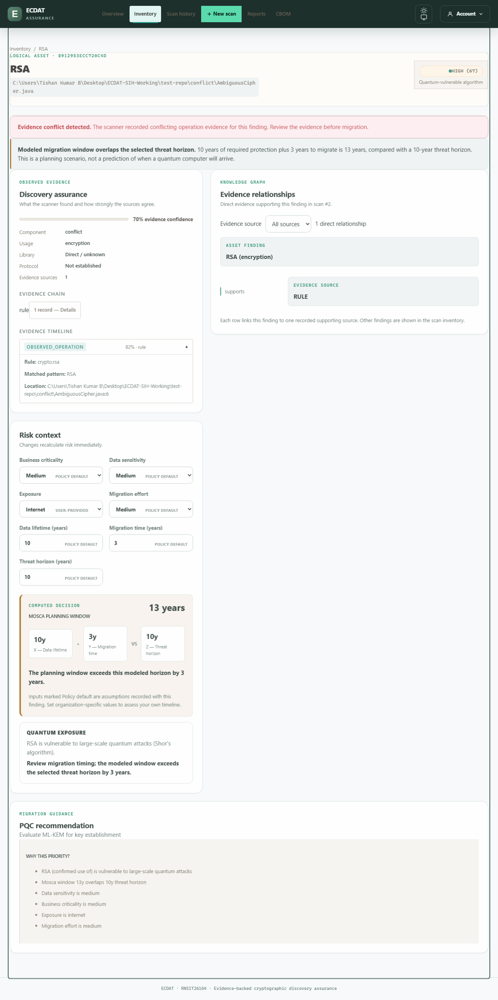


# Offline demonstration evidence

Generated by separate `--demo-pack` and `--browser --screenshots` runs of `scripts/rehearse_local_baseline.py` against disposable local data. Consult `control-results.json` for verified algorithms and counts. Each named CBOM is a complete schema-validated export of its corresponding control, with machine root paths replaced by `<working-copy>`.

The screenshots below show the separate bundled integration fixture, not the named control scans. They are pre-generated fallback evidence, not a live presentation or proof of source remediation.

The desktop screenshot deliberately includes an evidence-conflict warning from the ambiguous Java fixture. Explain that it requires review; do not present it as the unambiguous key-generation example in the timed control walkthrough.

## Evidence and editable risk context (desktop)

## Complete CBOM download (375px)

See [the timed walkthrough](../../impactx-demo.md) for interpretation and limits. The unfamiliar-presenter trial remains pending at the user's request.
