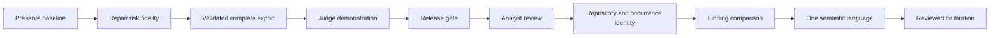

# ECDAT implementation plan informed by IBM Explorer and Keyfactor AgileSec

Prepared: 8 October 2026, India time. Status: Stages 0–1 passed; Stage 2 export and the explicitly authorized CBOM download integration passed. Other frontend improvements belong to the user's friends. Full dependency release gate remains open for two development dependency packages; see [integration verification](integration-verification-2026-10-08.md). Later stages remain planned.

## Objective and boundary

Deliver a credible repository discovery demonstration that explains what was found, why it matters, what remains unknown, and what changed after a reviewed fix. Use IBM as a reference for semantic discovery and Keyfactor for inventory lifecycle, without claiming equivalence.

Work only in `C:\Users\Tishan Kumar B\Desktop\ECDAT-SIH-Working`. Preserve the original project, existing work, private configuration, and databases. Keep the current RNSIT naming. IMPACTX submission uses the organizer-provided repository when supplied; no destination is assumed.

Research supporting this plan: [deep research](deep-research-ibm-keyfactor-2026-10-08.md). Estimates below are engineering judgments for one developer, including relevant tests; they are not delivery promises or vendor facts. The hackathon's actual remaining time is unknown, so use relative time boxes.

## Starting point

Existing: Python AST and multilingual rules; dependency/X.509 collectors; operation correlation; evidence-kind labels; heuristic confidence; editable risk context and provenance; scan lifecycle/admission; inventory/evidence/report views; CycloneDX-shaped output; signed roles; migrations.

Prior checks: 435 backend tests plus 95 subtests passed, four platform skips; 102 frontend tests passed; final mocked Chromium run 58/58 passed after one timeout. A real bundled fixture scan processed 9/9 files and produced 68 findings. These are scoped results, not enterprise readiness or detection accuracy. [Verification](hackathon-verification-2026-10-08.md).

New inspection findings requiring reproduction: risk PATCH can lose evidence-kind/provenance fidelity; CBOM validation is only structural; machine inference becomes default calibration labels; finding IDs are sensitive to source location. Do not present these as reproduced failures until Stage 1/2 tests demonstrate them.

## Delivery choices

| Track | Scope | Estimated effort | Decision |
|---|---|---:|---|
| Hackathon core | Stages 0–4: risk fidelity, usable exports, honest demo, complete verification | 9–15 hours | Recommended if enough time remains |
| Minimum demonstration | Stages 0–1, honest export labels, bundled fixture, rehearsal | 4–6 hours | Use if time is short; do not rush schema changes |
| Product iteration | Stages 5–9: review, identity/diff, semantics, reviewed calibration | 12–20 working days plus label collection | After the event |
| Enterprise expansion | Stages 10–11 | Separately scoped | Depends on validated requirements |

Do not begin another feature once fewer than two hours remain before submission; reserve that time for verification, clean packaging, and rehearsal. If a stage overruns, keep the last passing build and document the deferred capability. No feature is mandatory merely because a competitor advertises it.

## Stage 0 — Freeze and reproduce the baseline

Completed: PASS. Native local delivery selected; fresh disposable startup/scan and cleanup passed. Baseline status and file fingerprints saved. See [Stage 0 evidence](stage-0-baseline-2026-10-08.md).

**Time:** 30–60 minutes. **Dependency:** none.

Record existing modified/deleted/untracked files and actual branch/remotes; do not restore deleted documents or overwrite the working copy. Confirm fixture paths and supported scan scope. Reuse the current environment rather than performing broad upgrades. Save the gate results and known skips. Choose native local or hosted delivery explicitly: hosted mode is not established by the existing local tests.

**Exit:** reproducible startup and bundled scan with disposable data; known limits recorded; changes attributable to this plan can be reviewed independently. Stop if the baseline cannot be reproduced.

## Stage 1 — Preserve risk evidence and context during edits

Completed: PASS. Shared default policy, permission/input/audit regressions, and live edit → reload → JSON/CSV report verified. Combined gate: 448 passed, four Windows skips, 95 subtests. See [Stage 1 evidence](stage-1-risk-fidelity-2026-10-08.md). Frontend remains in the friends' workstream.

**Time:** 1.5–2.5 hours. **Files:** `backend/routers/assets.py`, `backend/services/risk_engine.py`, `backend/schemas/asset.py` if contract changes are needed; `backend/tests/test_mosca_provenance.py`, `dashboard/src/pages/AssetDetail.test.tsx`.

Reproduce a single-field PATCH for an observed operation and a capability finding. Include persisted evidence kind/quality in recalculation. Form the user-provided field set from prior provenance plus explicitly edited fields; never mark untouched default values as edited. Preserve unknown provenance for legacy data until a defined mapping is agreed. Do not rewrite the raw evidence or heuristic confidence when business context changes.

Define no-op behavior and default/reset semantics. If explicit reset requires an API change, defer it rather than interpreting omitted/null input silently. Align any engine/scanner default discrepancy through one documented policy source. Keep role checks and audit write in the transaction.

**Required regressions:** one-field edit leaves unrelated provenance unchanged; observed/capability semantics survive; no-op edit preserves score and reasons under the same policy; forbidden roles cannot write; audit records exact edits; invalid input and failed writes roll back.

**Exit:** reproduce red tests, repair, pass risk/provenance suites and the combined backend gate. Inspect a real edit → reload → report flow. No migration should be needed for the narrow repair.

## Stage 2 — Separate a complete CBOM export from the paginated UI

Backend completed: PASS. `/api/exports/cbom` supplies a complete bounded snapshot, official offline schema validation, safe evidence and risk provenance. Combined gate: 460 passed, four Windows skips, 95 subtests; live 68-finding fixture export validated. See [Stage 2 evidence](stage-2-cbom-verification-2026-10-08.md) and [endpoint contract](cbom-export-contract.md). The user subsequently authorized only the CBOM download connection, now integrated and verified through the real browser/API rehearsal; see [integration verification](integration-verification-2026-10-08.md). Native cryptoProperties mapping remains the separate post-event extension.

**Time:** 3–5 hours. **Files:** `backend/routers/outputs.py`, proposed `backend/services/cbom_export.py`, `scripts/validate_schema.py`, `backend/tests/test_cbom.py`, `dashboard/src/pages/CbomPage.tsx`, related tests; proposed `schemas/cyclonedx/1.6/`.

Keep the existing paginated view contract. Add a distinct bounded complete-download endpoint, proposed `GET /api/exports/cbom?scan_id=...`; do not label a 100-row UI page as a complete inventory. A completed scan is still risk-editable, so export a consistent database snapshot or an explicitly versioned export snapshot, including risk context. `ScanJobDB.result_version` does not currently version risk edits. Record processing gaps in standard metadata properties. If consistency cannot be established or the bounded export limit is exceeded, return an explicit error rather than truncating.

Pin the official CycloneDX 1.6 schema and referenced dependencies, including provenance/checksums, for offline validation. First validate the current payload and capture failures; do not assume the declared version proves conformity. Strip UI-only top-level pagination from the standalone document. Today's time box covers complete, lossless export and schema validation of the existing inventory/property representation. State its mapping limitations; schema acceptance alone does not establish native standardized cryptographic semantics. Preserve evidence via documented properties and supported references. Never export private key material or secrets.

**Post-event extension, separately estimated at 2–3 days:** map a named supported slice to real `cryptographic-asset` components and appropriate `cryptoProperties`, then extend to certificate/protocol relationships. Represent libraries as libraries and unknown parameters as unknown/omitted, not invented values. Publish exactly which finding kinds are natively mapped. Do not squeeze this full semantic mapping into today's 3–5-hour export task.

Choose an existing installed schema validator if available; otherwise treat a dependency addition as an explicit implementation dependency and record its version. Do not introduce an untested schema library immediately before submission.

**Required regressions:** official schema accepts empty, fixture, and >200-item exports; every expected finding is included or explicitly mapped; unique `bom-ref` values and no dangling references; invalid schema values fail; secret redaction; correct scan selector; UI pagination remains unchanged; incomplete/oversized exports fail clearly; concurrent risk edits cannot mix revisions in one export. For the native-mapping extension, malformed/nonsensical crypto properties must fail. Schema validity and semantic completeness get separate assertions.

**Exit:** a complete fixture export validates offline and can be inspected through an independent standards consumer where available. If this does not fit the time box, label current JSON as an ECDAT inventory export and defer the standards-conformance claim.

## Stage 3 — Make a clear three-minute judge workflow

Materials and automated verification: PASS. The timed walkthrough, three verified controls and offline screenshots/exports are ready. The unfamiliar-presenter trial remains pending at the user's request; the complete Stage 3 exit is not yet satisfied. See [Stage 3 evidence](stage-3-judge-workflow-2026-10-08.md) and [walkthrough](impactx-demo.md).

**Time:** 1.5–2.5 hours. **Files:** existing `Dashboard.tsx`, `ScanPage.tsx`, `ScanDetailPage.tsx`, `AssetDetail.tsx`, `RiskReport.tsx` as needed; `demo-repositories/`; proposed `docs/impactx-demo.md`.

Use controlled positive, negative, and mixed-risk fixtures. Reuse current pages and components. Demonstrate discovery → evidence → risk context → recommendation → export. Show supported-file processing, failures, observed operations versus declared capabilities, and which migration inputs are assumptions. Explain heuristic confidence and corpus-specific accuracy in plain language. Reuse current editing/provenance UI once Stage 1 is verified.

For today's hosted demo, prefer a fixed allowlisted repository and authenticated scanning; make the server-accessible-path limitation explicit. New archive ingestion, arbitrary Git cloning, and public browsing are not prerequisites. If hosting is selected, separately integrate the missing wrapper/configuration and test direct routes, `/ready`, authenticated access, and exports against that deployment. Do not blindly copy older public-demo flags unsupported by this code.

**Exit:** someone unfamiliar with ECDAT completes the scripted path without coaching; desktop and 375px views remain usable; failures are visible; offline screenshots and pre-generated fixture outputs support the same truthful story.

## Stage 4 — Release and submission gate

Full verification has been run: functional local gates passed, but the complete release gate failed at two frontend development dependency advisory packages. Stage 3 human trial is still pending. No submission packaging or push was performed. See [full verification](full-verification-2026-10-08.md).

**Time:** 2–4 hours reserved. **Dependency:** selected earlier stages complete.

Run the combined pytest suite, frontend unit tests, lint/formatting, production build and size budgets, relevant schema checks, and browser workflows. Include a real migrated disposable database/API test of login, scan, risk edit, inventory, CBOM/report downloads, and restart persistence. Mocked UI tests cannot replace the real-API path. Reproduce known browser flakiness rather than hiding it with retries. Run advisory/security checks when environment/network access permits; mark unavailable checks unverified.

Validate migrations on disposable databases if any schema changed. Record expected platform skips separately; every required capability needs evidence on a supporting platform. Stop temporary process trees and release database/file handles.

**Exit:** zero unexplained required failures or leaks, all selected feature contracts demonstrated, exact counts and limitations saved. Prepare a clean deliverable excluding secrets, databases, caches, virtual environments, and dependency/build folders unless submission rules require specific artifacts. Use only the actual organizer repository when supplied; pushing is a separate concrete action.

## Stage 5 — Introduce human review without replacing detector evidence

**Estimate:** 2–3 days. **Files:** proposed `backend/models/finding_review.py`, migration, schemas/router/service; existing `AssetDetail.tsx`, inventory filters and audit helpers.

Proposed verdicts: `unreviewed`, `confirmed`, `rejected`, `uncertain`. A verdict answers whether the stated finding is correct for its evidence kind; it does not mean risk accepted or migration complete. Keep disposition (`open`, `accepted_risk`, `planned`, `verified`) separate if introduced. Persist reviewer identity from the signed session, reason, time, revision/finding reference, and review version/history. Never accept reviewer identity supplied by the client. Machine `confirmed_use` remains a detector field.

Use a transactional latest-review record plus history, bounded notes, and optimistic version checks to avoid lost updates. Proposed writer roles: admin/security analyst; other roles read only. A rescan must not silently inherit a verdict where identity/evidence changed.

**Exit tests:** role enforcement, invalid verdict/input, concurrent edits, durable reload, immutable history, exact audit subject, migration preservation, and review UI keyboard/error handling. Do not train confidence from these labels yet.

## Stage 6 — Establish repository, occurrence, and scan identity

**Estimate:** 2–3 days. **Dependency:** current provenance normalized.

Add a repository key and scan metadata for branch/revision when available, profile/allowlist scope, detector/correlator/policy versions, and supported-file manifest. Uncommitted local trees need a snapshot/content identity, not a fabricated commit. Store object fingerprint separately from a source occurrence. Existing `logical_asset_id` includes line/column and is unsuitable as the sole cross-scan key.

Define a versioned match contract: exact matches first; bounded semantic-anchor matching for moved lines; duplicate/ambiguous matches remain ambiguous. Separate occurrence identity from algorithm/parameter state so a changed algorithm can appear as a change to the same operation. Without a reliable anchor, show unmatched findings instead of forcing correspondence. No silent cross-repository merges or historical hash rewrites.

**Exit tests:** line insertion, duplicate calls, location moves, algorithm/key-size changes, file rename policy, different repository/branch/profile, legacy scans without metadata, and identity stability within an unchanged snapshot.

## Stage 7 — Add finding-level before/after comparison

**Estimate:** 2–3 days. **Dependency:** Stage 6.

Proposed `GET /api/scans/compare?baseline_id=...&current_id=...` and `ScanCompare.tsx`. Show added, changed, unchanged, no-longer-observed, ambiguous, and unknown entries with evidence links and complete paginated totals. Compare only compatible repositories/scopes/versions; otherwise report incompatibility explicitly. A cancelled/failed/partial/excluded scan cannot prove an occurrence vanished. When manifests cannot prove a prior file was successfully revisited, classify it as unknown.

Keep no-longer-observed distinct from remediation verified. Verification requires a reviewed specific risk and fresh evidence at a recorded revision; it does not prove all deployed copies are fixed.

**Exit tests:** duplicates, changed algorithms, moved lines, false disappearance on parser failure, changed exclusions, incompatible scans, >200 findings, role enforcement, and real baseline → edit fixture → rescan → comparison workflow.

## Stage 8 — Extend one language semantically

**Estimate:** 4–7 days. **Recommendation:** JavaScript/TypeScript Node crypto first; Java is an alternative after reviewing target users. This is a proposed choice, not a vendor requirement.

Use a pinned parser and a bounded operation catalog. Resolve imports/CommonJS aliases, local shadowing, literals, and selected single-scope assignments for hashing, HMAC, ciphers, and key operations. Preserve unresolved arguments and wrapper boundaries explicitly. Normalize output through the current collector/evidence interface. Keep library declarations as capability evidence; do not execute code or count mere algorithm words as operations.

**Exit:** independently labelled, repository-separated holdout cases cover aliases, unrelated names, comments, dynamic arguments, multiline calls, wrappers, and negatives. Publish metrics by language/evidence kind and compare against the frozen pre-change baseline. Suggested supported-slice target: ≥95% precision/recall with no regression on established negatives; this is a goal, not an accuracy claim. Report uncertainty/sample size and abstentions. Broader dataflow and Java classpath analysis remain later work.

## Stage 9 — Calibrate confidence from reviewed outcomes

**Estimate:** 2–4 days engineering plus additional data-collection time. **Dependency:** Stage 5; reliable Stage 6 identity; frozen detector release.

Replace automatic correctness labels from `confirmed_use` with reviewed outcomes and explicit dataset provenance. Exclude unreviewed/uncertain outcomes; distinguish human decisions from synthetic examples. Preserve score-at-review, collector/evidence kind, model version, reviewer, snapshot, and dedup key. Prevent leakage across training/calibration/test by splitting at repository/project level; related revisions stay in the same partition.

Reuse existing Brier/ECE helpers. Evaluate per-kind calibration, reliability curves, sample counts, and uncertainty on a held-out set. Sparse strata stay heuristic; no universal minimum count is asserted as sufficient. Register model artifacts and provide rollback. Do not overwrite frozen historical benchmark results.

**Exit:** no machine-derived labels masquerading as truth; reproducible disjoint partitions; no duplicate leakage; measured holdout improvement over raw scores without hiding worse strata. Until then use “evidence confidence score,” not probability of correctness.

## Stage 10 — Add bounded ingestion and accountability

**Estimate:** 3–5 days for one ingestion mode, excluding enterprise rollout. **Dependency:** repository identity and access-control design.

Start with one controlled archive-upload mode or one allowlisted repository provider after selecting actual demand. Enforce compressed/expanded sizes, file counts, extraction-time limits, path traversal/symlink rejection, no execution/hooks, storage isolation and cleanup. Reject nested archives unless explicitly supported. Repository ownership/access scope must be enforced server-side before multi-user uploads; signed roles alone are insufficient.

Add explicit owner assignment and optional CODEOWNERS hints with provenance. Imported hints are not authorization. A Git mode needs host allowlisting, credential isolation, SSRF controls, fetch/time limits and branch/revision capture. No unrestricted remote URL ingestion.

**Exit:** malicious archives/URLs, budget exhaustion, cancellation/crash cleanup, cross-user access denial, audit, and real ingestion-to-export tests.

## Stage 11 — Enterprise roadmap, separately scoped

Potential projects: TLS/network observation, KMS/HSM/certificate-store adapters, archive/container/binary discovery, SSO/tenancy, managed secrets, backups/restore drills, remote collectors, shared throttling, distributed/multi-instance operation of the existing database-backed queue/leases, and hardened worker isolation. Each needs its own data contract, threat model, realistic corpus and operational gate. Do not replace the current stack with Kafka/OpenSearch/Kubernetes merely to resemble AgileSec. Do not build an automatic PQC source rewrite/proxy before compatibility and interoperability requirements are established.

## Execution and reporting contract

For each stage: reproduce the defect/gap; freeze the behavioral contract; add a meaningful failing regression; implement the smallest cohesive change; run narrow and related checks; run the required combined/manual gate; record result and cleanup. Do not weaken tests, infer pass from code presence, or dismiss required failures as pre-existing.

Report: stage, reproduced issue, files changed, exact checks/counts/skips, manual behavior, schema/API compatibility, cleanup, remaining uncertainty, and PASS/BLOCKED. Advance only when the selected gate is satisfied. This document delivers a plan; it does not authorize vendor purchases, dependency upgrades, hosted publication, or submission to an unknown repository.
